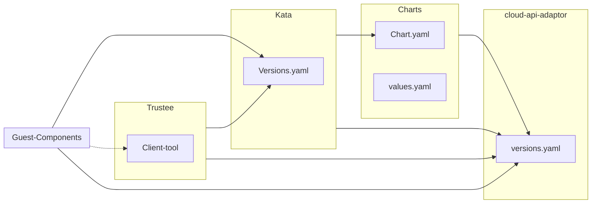

# v<TARGET_RELEASE>

## Overview

The release process mainly follows from this dependency graph.



Starting with v0.9.0 the release process no longer involves centralized dependency management.
In other words, when doing a CoCo release, we don't push the most recent versions of the subprojects
into Kata. Instead, dependencies should be updated during the normal process of development.
After the release, we typically cut a release of the subprojects that reflects whatever commit was used
in the Kata release.

## The Steps

### Prepare the Helm Charts Release

The [charts repository](https://github.com/confidential-containers/charts) provides a `scripts/prepare-release.sh`
script that automates most of the release preparation. See the [scripts README](https://github.com/confidential-containers/charts/blob/main/scripts/README.md) for detailed documentation.

- [ ] 1. :wrench: **Run the prepare-release script**

    Clone the charts repository and run the release preparation script:

    ```bash
    cd /path/to/confidential-containers/charts
    
    # For a minor version bump (e.g., 0.17.0 → 0.18.0)
    ./scripts/prepare-release.sh minor
    
    # Or for a patch version bump (e.g., 0.17.0 → 0.17.1)
    ./scripts/prepare-release.sh
    ```

    The script will:
    - Fetch the latest kata-containers release from GitHub
    - Update `Chart.yaml` with new chart and kata-deploy versions
    - Update Helm dependencies (`helm dependency update`)
    - Create a branch, commit, push, and open a PR

- [ ] 2. :eyes: **Review and merge the release PR**

    - Review the automatically created PR
    - Ensure the kata-deploy version matches the intended Kata Containers release
    - Test the changes if needed
    - Merge the PR

### Cut the Charts Release

- [ ] 3. :trophy: **Trigger the Release workflow**

    After the PR is merged:
    1. Go to **Actions** → **Release Helm Chart** in the charts repository
    2. Click **Run workflow**
    3. Select the **main** branch
    4. Click **Run workflow**

    This will:
    - Create a git tag (`v{version}`)
    - Package the Helm chart
    - Publish to GHCR (`ghcr.io/confidential-containers/charts/confidential-containers:{version}`)
    - Create a GitHub Release with the chart artifact

### Other Releases

- [ ] 4. :wrench: **Create a peer pods release**

    Create a peer pods release based on the Kata release, by following the [documented flow](https://github.com/confidential-containers/cloud-api-adaptor/blob/main/docs/Release-Process.md).

- [ ] 5. :green_book: **Update the release notes and tag this repository**

    Make sure to update the [release notes](https://github.com/confidential-containers/confidential-containers/tree/main/releases) and tag/release the confidential-containers repo using the GitHub release tool.

### Post-release

- [ ] 6. :pushpin: **Tag the version of guest-components used in the release**.

    Go look at [versions.yaml](https://github.com/kata-containers/kata-containers/blob/main/versions.yaml)
    in Kata Containers and find the version of the guest-components that was used in the Kata release.
    Tag this commit in guest-components with the latest version of guest components.
    Note that the version of guest-components might not be the same as the version of CoCo.

- [ ] 7. :scissors: **Cut a release of guest-components using GitHub release tool**

- [ ] 8. :pushpin: **Tag the version of Trustee used in the release**

    Follow the same process as step 6 but for Trustee.

- [ ] 9. :scissors: **Cut a release of Trustee using GitHub release tool**

- [ ] 10. :wrench: **Tag the Trustee release images**

    Use the Trustee release helper script to push the CI images corresponding to the released hash
    as the release images.

- [ ] 11. :pushpin: **Tag the latest version of the website for the release**

    Make sure the website is up-to-date for the latest release, and then tag the repo.
