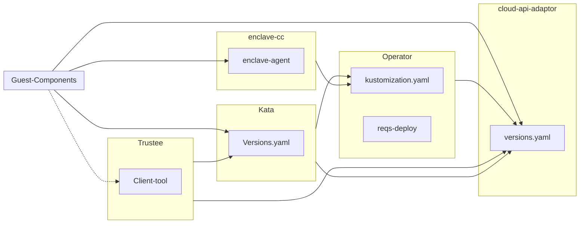

# v<TARGET_RELEASE>

## Overview

The release process mainly follows from this dependency graph.

Starting with v0.9.0 the release process no longer involves centralized dependency management.
In other words, when doing a CoCo release, we don't push the most recent versions of the subprojects
into Kata and enclave-cc. Instead, dependencies should be updated during the normal process of development.
After the release, we typically cut a release of the subprojects that reflects whatever commit was used
in the Kata release.

## The Steps

Note: It may be useful when doing these steps to refer to a previous example. The v0.9.0-alpha1 release applied [these changes](https://github.com/confidential-containers/operator/pull/388/files). After following steps 1-5 below, you should end up with a similar set of changes.

### Determine release builds

Identify/create the bundles that we will release for Kata and enclave-cc.

- [ ] 1. :eyes: **Create enclave-cc release**

    Enclave-cc does not have regular releases apart from CoCo, so we need to make one.
    Make sure that the CI [is green](https://github.com/confidential-containers/operator/actions/workflows/enclave-cc-cicd.yaml) and then use the Github release tool to create a tag and release.
    This should create a bundle [here](https://quay.io/repository/confidential-containers/runtime-payload?tab=tags).

- [ ] 2. :eyes: **Find Kata release version**

    The release will be based on an existing Kata containers bundle.
    You should use a release of Kata containers.
    Release bundles can be found [here](https://quay.io/repository/kata-containers/kata-deploy?tab=tags).
    There is also a bundle built for [each commit](https://quay.io/repository/kata-containers/kata-deploy-ci?tab=tags).
    If you absolutely cannot use a Kata release,
    you can consider releasing one of these bundles.

### Update the Operator

- [ ] 3. :eyes: **Check operator pre-installation and open PR if needed**
    
    The operator uses a pre-install container to setup the node.
    Check that the container matches the dependencies used in Kata
    and that the operator pulls the most recent version of the container.

    * Check that the version of the `nydus-snapshotter` used by Kata matches the one used by the operator
        * Compare the `nydus-snapshotter` version in Kata [versions.yaml](https://github.com/kata-containers/kata-containers/blob/main/versions.yaml) (search for `nydus-snapshotter` and check its `version` field) with the [Makefile](https://github.com/confidential-containers/operator/blob/main/install/pre-install-payload/Makefile) (check the `NYDUS_SNAPSHOTTER_VERSION` value) for the operator pre-install container.
            * **If they do not match, stop and open a PR now. In the PR, update the operator's Makefile to match the version used in kata. After the PR is merged, continue.**

- [ ] 4. :wrench: **Open a PR to the operator to update the release artifacts**

    Update the operator to use the payloads identified in steps 1, 2, 3, and 4.

    Make sure that the operator pulls the most recent version of the pre-install container

    * Find the last commit in the [pre-install directory](https://github.com/confidential-containers/operator/tree/main/install/pre-install-payload)
        * As a sanity check, the sha hash of the last commit in that pre-install directory will correspond to a pre-install image in quay, i.e. a reqs-payload image [here](https://quay.io/confidential-containers/reqs-payload).
    * Make sure that the commit matches the preInstall / postUninstall image specified for [enclave-cc CRD](https://github.com/confidential-containers/operator/blob/main/config/samples/enclave-cc/base/ccruntime-enclave-cc.yaml) and [ccruntime CRD](https://github.com/confidential-containers/operator/blob/main/config/samples/ccruntime/default/kustomization.yaml)
        * If these do not match (for instance if you changed the snapshotter in step 4), update the operator so that they do match.

    There are a number of places where the payloads are referenced. Make sure to update all of the following to the tag matching the latest commit hash from steps 1, 2, and 3:
    * Enclave CC:
      * [sim](https://github.com/confidential-containers/operator/blob/main/config/samples/enclave-cc/sim/kustomization.yaml)
      * [hw](https://github.com/confidential-containers/operator/blob/main/config/samples/enclave-cc/hw/kustomization.yaml)
      * [base](https://github.com/confidential-containers/operator/blob/main/config/samples/enclave-cc/base/ccruntime-enclave-cc.yaml)
    * Kata Containers:
      * [default](https://github.com/confidential-containers/operator/blob/main/config/samples/ccruntime/default/kustomization.yaml)
      * [s390x](https://github.com/confidential-containers/operator/blob/main/config/samples/ccruntime/s390x/kustomization.yaml)
      * [peer-pods](https://github.com/confidential-containers/operator/blob/main/config/samples/ccruntime/peer-pods/kustomization.yaml)
          Note that we need the quay.io/confidential-containers/runtime-payload-ci registry and kata-containers-latest tag

    **Also, update the [operator version](https://github.com/confidential-containers/operator/blob/main/config/release/kustomization.yaml) (update the `newTag` value)**

### Final Touches

- [ ] 5. :trophy: **Cut an operator release using the GitHub release tool**

- [ ] 6. :wrench: **Create a peer pods release**

    Create a peer pods release based on the Kata release, by following the [documented flow](https://github.com/confidential-containers/cloud-api-adaptor/blob/main/docs/Release-Process.md).

- [ ] 7. :green_book: **Make sure to update the [release notes](https://github.com/confidential-containers/confidential-containers/tree/main/releases) and tag/release the confidential-containers repo using the GitHub release tool.**

### Post-release

- [ ] 8. :wrench: **Open a PR to the operator to go back to latest payloads after release**
    After the release, the operator's payloads need to go back to what they were (e.g. using "latest" instead of a specific commit sha). As an example, the v0.9.0-alpha1 release applied [these changes](https://github.com/confidential-containers/operator/pull/389/files). You should use `git revert -s` for this.

- [ ] 9. :pushpin: **Tag the version of guest-components used in the release**.

    Go look at [versions.yaml](https://github.com/kata-containers/kata-containers/blob/main/versions.yaml)
    in Kata Containers and find the version of the guest-components that was used in the Kata release.
    Tag this commit in guest-components with the latest version of guest components.
    Note that the version of guest-components might not be the same as the version of CoCo.

- [ ] 10. :scissors: **Cut a release of guest-components using GitHub release tool**

- [ ] 11. :pushpin: **Tag the version of Trustee used in the release**

    Follow the same process as step 9 but for Trustee.

- [ ] 12. :scissors: **Cut a release of Trustee using GitHub release tool**

- [ ] 13. :wrench: **Tag the Trustee release images**

    Use the Trustee release helper script to push the CI images corresponding to the released hash
    as the release images.

- [ ] 14. :pushpin: **Tag the latest version of the website for the release**

    Make sure the website is up-to-date for the latest release, and then tag the repo.
