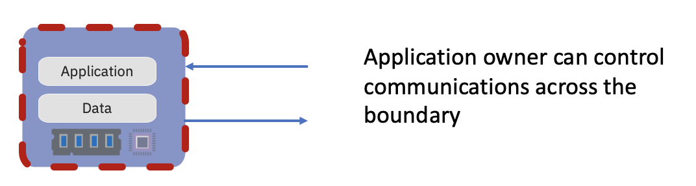
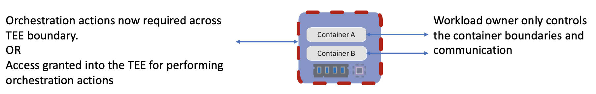

# Confidential Containers

We are interested in integrating existing [Trusted Execution Environments](https://en.wikipedia.org/wiki/Trusted_execution_environment)
(TEE) infrastructure support and technologies with the cloud native world. 

Key considerations are:
- Allow cloud native application owners to enforce application security requirements
- Transparent deployment of unmodified containers
- Support multiple TEE and hardware platforms
- Introduce a trust model which separates Cloud Service Providers (CSPs) from guest applications
- Apply least privilege principles to the Kubernetes Cluster administration capabilities which
  impact delivering Confidential Computing for guest application or data inside the TEE.

TEE's can be used to encapsulate different levels of the architecture stack with three key levels
being node v pod v container. Container isolation was initially
[provided in kata-containers](https://github.com/kata-containers/kata-containers/blob/main/docs/use-cases/using-Intel-SGX-and-kata.md).
As an outgrowth of that project we are now expanding to address pod level support for confidential
computing. Node level introduces significant challenges around least privilege for kubernetes
cluster administration. We will explore the combination of pod and container level isolation, and we
expect that challenges explored will have relevance to future understanding of the use of TEE's at
the node level.

## Why?
Security has long been a significant concern with data encryption at rest and in flight
assumed to be a key part of any offering.  Trusted Execution Environments look to address the data
in use security concern.

Cloud Computing adoption continues to accelerate whether it be Public, Private or increasingly
common a Hybrid approach and with it the trust boundaries change. Consideration of Insider Threats
needs to now consider the cloud provider, infrastructure provider, managed service provider.

Certain Industries are heavily focused on compliance to standards, governments too are concerned
both [collectively](https://www.un.org/counterterrorism/cybersecurity) and
[individually](https://www.whitehouse.gov/briefing-room/presidential-actions/2021/05/12/executive-order-on-improving-the-nations-cybersecurity/).
The standards expected to protect software solutions continue to evolve towards a concept of
Confidential Computing

Confidential Containers look to address the growing conern and needs of these three areas combining
and growing in the future.

## How?
### Trusted Execution Environments 

We are actively working to support multiple TEE Technologies
- AMD Secure Encrypted Virtualization(SEV, SEV-ES)
- Intel Software Guard Extensions (SGX)
- Intel Trusted Domain Extensions (TDX)
- IBM 
  - Protected Execution Facility (PEF)
  - Secure Execution for Linux (SE)

The TEE seeks to protect the Application and Data from outside threats, with the Application owner
having complete control of all communication across the TEE boundary. The application is considered
a single complete entity and once supplied with the resources it requires, the TEE protects those
resources (memory and cpu) from the infrastructure and all communication across the TEE boundary is
under the control of the Application Owner.

### Cloud Native Execution Environments 

However moving to a more cloud native approach, the application is now considered a group of one or
more containers, with shared storage and network resources (pod). This pod is also subject to an
orchestration layer which needs to dynamically interact with the pods and containers with respect to
provisioning, deployment, networking, scaling, availability, and lifecycle management.

How does the application owner trust the orchestration actions required to deliver on the Cloud
Native promise, take advantage of the TEE capabilities and deliver on their compliance/ security
requirements?

Our goal is to establish patterns using TEE's to lock out the Cloud Service Provider (CSP) ,
establish deprivileged orchestration (kubernetes admin) and still be able to build and deploy cloud
native workloads.

### Integration of Technologies
With many TEE technologies requiring a KVM boundary between the host
and guest, [Kata Containers](https://katacontainers.io/) are the basis for our initial work. The
Kata Containers project already supports a KVM boundary between a Kubernetes Node and Kubernetes Pod
and focuses on reducing the concern of a Guest attacking the Host, in this case a breakout from
containers within the pod attacking the Kubernetes Node.

Requests from TEE vendors to support their technology within Kata Containers project led to
consideration of 
[Confidential Computing Enablement](https://github.com/kata-containers/kata-containers/issues/1332).
How to protect the guest from the host, in this case to protect the Containers and workload within a
Pod from the Kubernetes Node.

Initial exploration led to the realisation that this was not a problem possible to solve within the
Kata Containers Project alone, it raises considerations that need to be discussed and resolved in
other areas of a cloud native stack, from container runtime to CSI to orchestration(kubelet) and
brings in new projects or concerns such as attestation, reconsidering trust domains and least
privilege capabilities for kubernetes admin.

