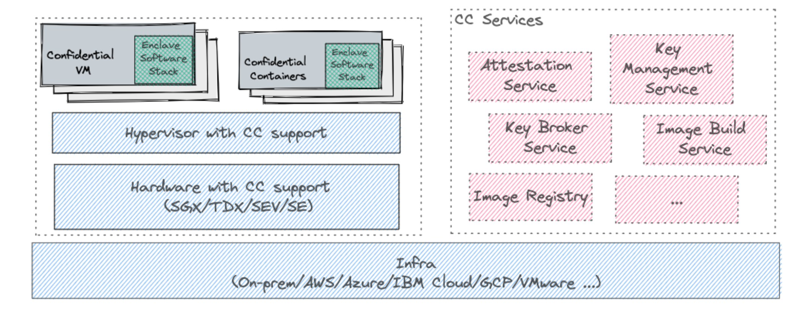
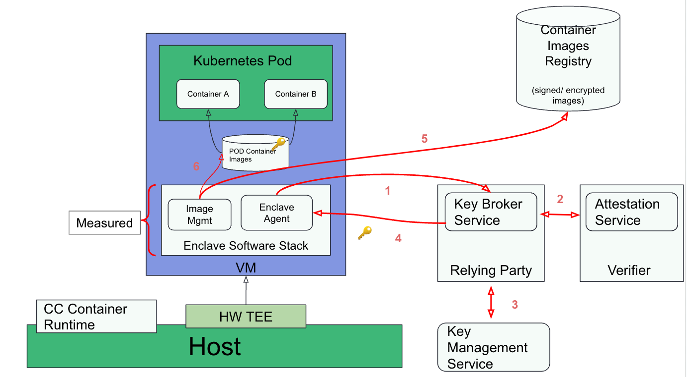
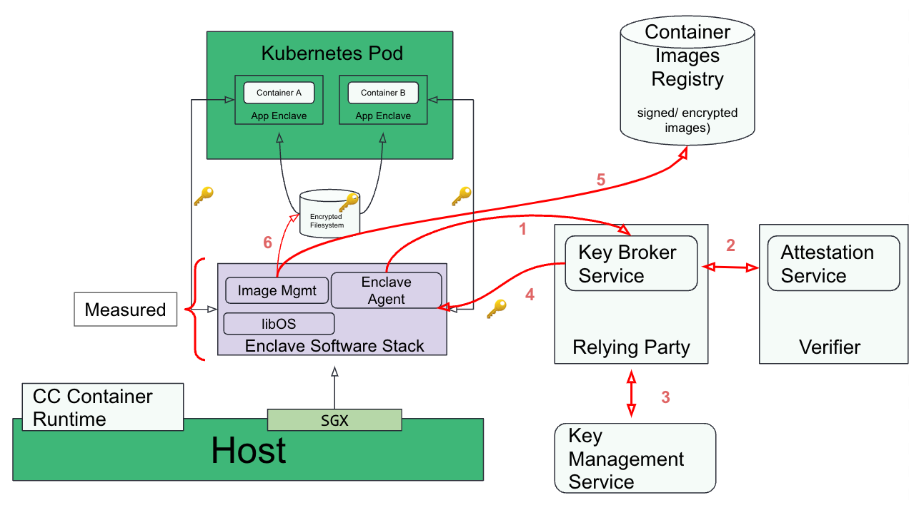
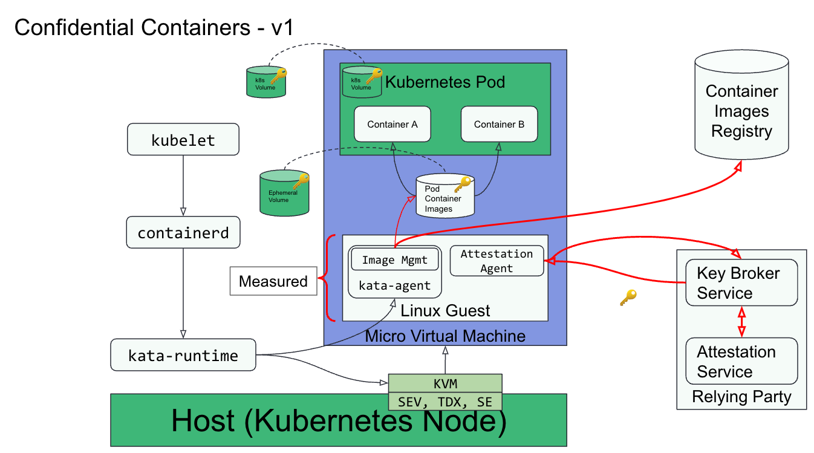
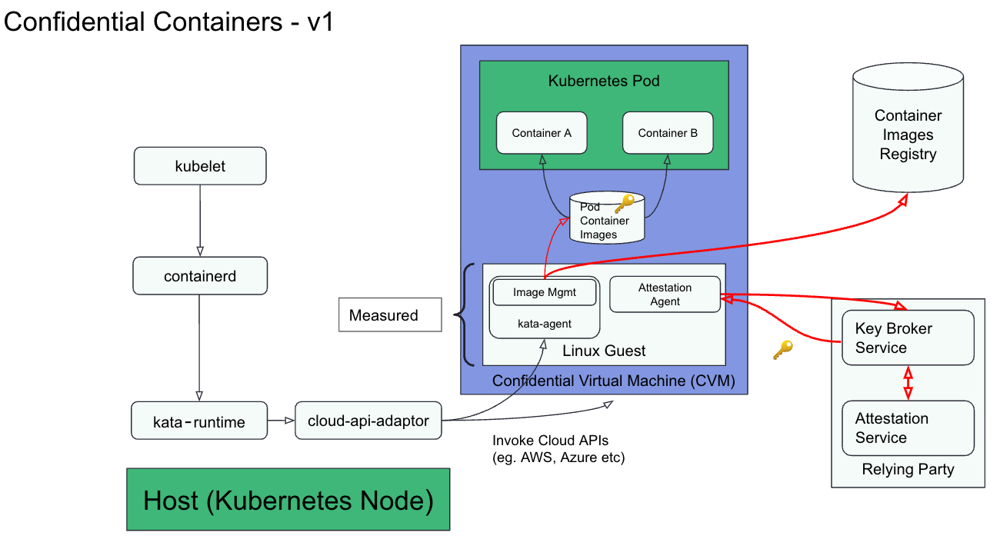
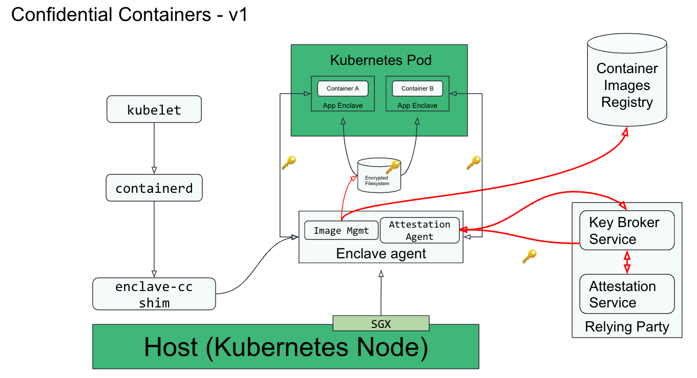

# Confidential Computing Overview

> Confidential Computing protects data in use by performing computation in a
> hardware-based Trusted Execution Environment.
> These secure and isolated environments prevent unauthorized access or
> modification of applications and data while they are in use, thereby increasing
> the security level of organizations that manage sensitive and regulated data.
>
> A Trusted Execution Environment (TEE) is commonly defined as an environment that
> provides a level of assurance of data integrity, data confidentiality, and code
> integrity. A hardware-based TEE uses hardware-backed techniques to provide
> increased security guarantees for the execution of code and protection of data
> within that environment.

Key Characteristics of Confidential Computing, as defined by the
[Confidential Computing Consortium](https://confidentialcomputing.io/wp-content/uploads/sites/85/2021/03/confidentialcomputing_outreach_whitepaper-8-5x11-1.pdf):

- **Data confidentiality:** Unauthorized entities cannot view data while it is
  in use within the TEE
- **Data integrity:** Unauthorized entities cannot add, remove, or alter data
  while it is in use within the TEE
- **Code integrity:** Unauthorized entities cannot add, remove, or alter code
  executing in the TEE

# Confidential Computing Building Blocks

## Key Components

The following diagram shows how the different building blocks for Confidential
Computing (CC) come together:

Let’s start by describing the lower level blocks of the CC solution
(**colored blue**):

- **Infra layer** - be it on-premises (bare metal, VMware etc.) or public clouds
  (AWS, Azure, GCP, etc.)
  - **Hardware with CC support** - this includes 2 distinct models:
    - **VM-based TEEs**  - In this model, memory is encrypted along a
      traditional VM boundary running on top of a VMM. AMD SEV-SNP, Intel TDX,
      IBM Secure Execution and Protected Execution Functionality (PEF) are
      examples of VM-based TEEs.
    - **Process-based TEEs** - In this model, a process that needs to run
      securely is divided into two components: trusted and untrusted.
      The trusted component resides in encrypted memory and handles confidential
      computing, while the untrusted component interfaces with the operating
      system and propagates I/O from encrypted memory to the rest of the system.
      Intel SGX is an example of a process-based TEE.
- **Hypervisor** - this includes hypervisors such as QEMU/KVM, cloud hypervisor,
  public cloud provider hypervisors etc...

The **Confidential Computing services block** contains a number of services
(**colored pink**) which are required for creating a holistic CC platform which
the customer can then use to build their solution. This currently includes the
following services:

- **Attestation service** -  The primary purpose of the attestation service is
  to validate the evidence provided by the hardware TEE. This is the *Verifier*,
  as defined in the [RATS architecture](https://www.rfc-editor.org/rfc/rfc9334).
- **Key Broker Service (KBS)** -  The KBS is the *Relying Party*, as defined by
  the [RATS architecture](https://www.rfc-editor.org/rfc/rfc9334).
  Following are its primary functions:
  - Receive evidence from the *Attester* (confidential VM or container) via a
    challenge-response protocol.
  - Relay the evidence to the Attestation Service for verification.
  - Apply appraisal policy for the returned Attestation Results to assess the
    trustworthiness of the *Attester*.
  - Interact with the Key Management Service to retrieve the keys and then
    send them back to the *Attester*.
- **Key management service** - A service for securely storing, managing and
  backing up of cryptographic keys used by applications and users.
- **Image build service** - Services used to build confidential containers or VM
  images for end users.
- **Image registry** - A service that is used to store encrypted and/or signed
  container and VM images required for CC workloads. Examples of such registries
  include [Quay.io](https://quay.io/), [Docker Hub](https://hub.docker.com/),
  CSPs provided registries, etc.

Both the **Confidential VM** and the **Confidential Containers** block contain
the **Enclave Software Stack**. This stack is made of the trusted CC components
responsible for collectively running the whole attestation flows, and for
example:
- Unblocking a confidential VM boot process after injecting a guest owned secret
  released by the relying party.
- Decrypting and unpacking a protected container image, and running its
  associated  workload.

## Confidential Container Stack

The CC components can be arranged together and configured to provide
containerized workloads with the Confidential Computing security guarantees.

The two following sections describe a generic software architecture for
Kubernetes pods to run in either VM-based or process-based TEEs.

Although internal implementations for the two approaches differ, they share the
same goals and attributes:

- Remove cloud and infrastructure providers from the guest application Trusted
  Computing Base (TCB).
- Integrate natively with the Kubernetes control plane.
- Provide an unmodified Kubernetes user and developer experience.
- Deploy unmodified workloads.

### VM-based TEE

VM-based TEEs (e.g. AMD SEV-SNP, IBM SE or Intel TDX) can be used to build a
confidential containers software architecture:

Following is the workflow when deploying a Kubernetes pod with VM-based TEEs:

- CC workload preparation
  - User builds the container image(s) (e.g. with tools like `podman`).
  - User signs/encrypts the container image(s).
  - User pushes the container image(s) to the image registry.
- Deploying the CC workload in k8s
  - User deploys the workload (`kubectl apply -f cc_workload.yaml`).
  - Kubernetes schedules the workload to target host having the required
    capability to run confidential containers.
- CC workload execution flow (**red connector** in the diagram)
  - Confidential containers runtime on the host starts the VM TEE (The enclave).
  - Enclave (agent) performs remote attestation: **steps 1-2 in the diagram**.
  - Enclave (agent) gets the keys required to verify/decrypt the containers
    image(s):  **steps 3-4 in the diagram**.
  - Enclave (image management) downloads the container image(s) : **step 5 in
    the diagram**.
  - Enclave verifies/decrypts the container image(s) : **step 6 in the diagram**.
  - Enclave starts the container workload.

### Process-based TEE

The confidential containers software architecture can also be built on top of
process-based TEEs like e.g. Intel SGX:

Following is the workflow when deploying a Kubernetes pod with a process-based
TEEs. The main differences from the VM-based TEE approach are the last 3 steps
involving interaction between 2 enclave processes:

- CC workload preparation
  - User builds the container image(s) (e.g. with tools like `podman`).
  - User signs/encrypts the container image(s).
  - User pushes the container image(s) to the image registry.
- Deploying the CC workload in k8s
  - User deploys the workload (`kubectl apply -f cc_workload.yaml`).
  - Kubernetes schedules the workload to target host having the required
    capability to run confidential containers.
- CC workload execution flow (**red connector** in the diagram)
  - Confidential containers runtime on the host starts the enclave agent.
  - Enclave (agent) performs remote attestation: **steps 1-2 in the diagram**.
  - Enclave (agent) gets the keys required to verify/decrypt the containers
    image(s): **steps 3-4 in the diagram**.
  - Enclave (image management) downloads the container image(s) : **step 5 in
    the diagram**.
  - Enclave verifies, decrypts and writes the container image(s) to a local
    encrypted filesystem: **step 6 in the diagram**.
  - The runtime starts the app enclave which reads the container bundle from the
    encrypted filesystem.
  - Secure use of the encrypted filesystem is facilitated by a key exchange
    between the agent and app enclaves using either sealing or local attestation.

As can be seen, the flows for process and VM-based TEEs are almost identical. It
should be noted that process-based TEE requires a few additional software
components like `libOS` without which the application requires re-architecting.
This is not the case for VM-based TEEs. Conversely, Process based TEEs do not
require a separate VM and CC-aware hypervisor.

The up-to-date design for the Confidential Containers process-based architecture
is maintained in the [enclave-cc documentation](https://github.com/confidential-containers/enclave-cc/blob/main/docs/design.md).

# CNCF Confidential Containers

The CNCF Confidential Containers project is an implementation of the
confidential containers architecture described in the previous section.

It relies on several major cloud native components like `containerd`, both the
`Kata Containers` and the `enclave-cc` runtimes, or the `ocicrypt` container
image encryption APIs.
It also depends on the standard Linux virtualization stack, including the `KVM`
hypervisor and open source VMMs like `QEMU` or `cloud-hypervisor`.

The project supports both VM-based and process-based TEEs, with the key
objective to reuse the generic components around enclave agent and attestation
services across both TEE models.

It is a [Cloud Native Computing Foundation Sandbox](https://www.cncf.io/projects/confidential-containers/)
project.

The following diagram shows the upcoming v1 architecture to run Confidential
Containers using VM-based TEEs and the Kata Containers runtime:

The following diagram shows the upcoming v1 architecture to run Confidential
Containers using VM-based TEEs by leveraging the peer-pods approach. This relies on Kata Containers remote hypervisor support and the [cloud-api-adaptor](https://github.com/confidential-containers/cloud-api-adaptor/) project:

The following diagram shows the upcoming v1 architecture to run Confidential
Containers using the Intel SGX process-based TEE. It relies on the
[enclave-cc](https://github.com/confidential-containers/enclave-cc) project:

