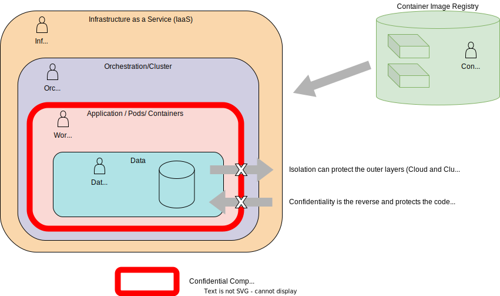

# Trust Model Considerations - Personas

## Personas
Otherwise referred to as actors or agents, these are individuals or groups capable of
carrying out a particular threat.
In identifying personas we consider :
- The Runtime Environment, Figure 5, Page 19 of CNCF
  [Cloud Native Security Paper](https://github.com/cncf/tag-security/blob/3e57e7c472f7053c693292281419ab926155fe2d/community/resources/security-whitepaper/v2/CNCF_cloud-native-security-whitepaper-May2022-v2.pdf).
  This highlights three layers, Cloud/Environment, Workload Orchestration, Application.
- The Kubernetes
  [Overview of Cloud Native Security](https://kubernetes.io/docs/concepts/security/overview/)
  identifies the 4C's of Cloud Native
  Security as Cloud, Cluster, Container and Code. However data is core to confidential
  containers rather than code.
- The Confidential Computing Consortium paper
  [A Technical Analysis of Confidential Computing](https://confidentialcomputing.io/wp-content/uploads/sites/10/2023/03/CCC-A-Technical-Analysis-of-Confidential-Computing-v1.3_unlocked.pdf)
 defines Confidential Computing as the protection of data in use by performing computations in a
  hardware-based Trusted Execution Environment (TEE).

In considering personas we recognise that a trust boundary exists between each persona and we
explore how the least privilege principle (as described on Page 40 of
  [Cloud Native Security Paper](https://github.com/cncf/tag-security/blob/3e57e7c472f7053c693292281419ab926155fe2d/community/resources/security-whitepaper/v2/CNCF_cloud-native-security-whitepaper-May2022-v2.pdf)
) should apply to any actions which cross these boundaries.

 Confidential containers can provide enhancements to ensure that the expected code/containers
 are the only code that can operate over the data. However any vulnerabilities within this code
 are not mitigated by using confidential containers, the Cloud Native Security Whitepaper
 details Lifecycle aspects that relate to the security of the code being placed into containers
 such as Static/Dynamic Analysis, Security Tests, Code Review etc which must still be followed.

Any of these personas could attempt to perform malicious actions:

### Infrastructure Operator
This persona has privileges within the Cloud Infrastructure which includes the hardware and
firmware used to provide compute, network and storage to the Cloud Native solution.
They are responsible for availability of infrastructure used by the cloud native environment.
- Have access to the physical hardware.
- Have access to the processes involved in the deployment of compute/storage/memory used by any
  orchestration components and by the workload.
- Have control over TEE hardware availability/type.
- Responsibility for applying firmware updates to infrastructure including the TEE Technology.

Example : Cloud Service Provider (CSP), Infrastructure as a Service (IaaS), Site Reliability Engineer, etc.
(SRE)

### Orchestration Operator
This persona has privileges within the Orchestration/Cluster.
They are responsible for deploying a solution into a particular cloud native environment and
managing the orchestration environment.
For managed cluster this would also include the administration of the cluster control plane.
- Control availability of service.
- Control webhooks and deployment of workloads.
- Control availability of cluster resources (data/networking/storage) and cluster
  services (Logging/Monitoring/Load Balancing) for the workloads.
- Control the deployment of runtime artifacts initially required by the TEE during
  initialisation.
 These boot images once initialised will receive the workload.

Example : A kubernetes administrator responsible for deploying pods to a cluster and
maintaining the cluster.

### Workload Provider
This persona designs and creates the orchestration objects comprising the solution (e.g.
kubernetes pod descriptions etc). These objects reference containers published by Container Image Providers.
In some cases the Workload and Container Image Providers may be the same entity.
The solution defined is intended to provide the Application or Workload which in turn provides
value to the data owners (customers and clients).
The workload provider and data owner could be part of same company/organisation but
following the least privilege principle the workload provider should not be able to view or
manipulate end user data without informed consent.
- Need to prove to customer aspects of compliance.
- Defines what the solution requires in order to run and maintain compliance (resources, utility
  containers/services,  storage).
- Chooses the method of verifying the container images (from those supported by Container Image
  Provider) and obtains artifacts needed to allow verification to be completed within
  the TEE.
- Provide the boot images initially required by the TEE during
  initialisation or designates a trusted party to do so.
- Provide the attestation verification service, or designate a trusted party to provide the
  attestation verification service.

Example : 3rd party software vendor, cloud solution provider

### Container Image Provider

This persona is responsible for the part of the supply chain that builds container images and
provides them for use by the solution. Since a workload can
be composed of multiple containers, there may be multiple container image providers, some
will be closely connected to the workload provider (business logic containers), others more
independent to the workload provider (side car containers). The container image provider is expected
to use a mechanism to allow provenance of container image to be established when a
workload pulls in these images at deployment time. This can take the form of signing or encrypting
the container images.
- Builds container images.
- Owner of business logic containers. These may contain proprietary algorithms, models or secrets.
- Signs or encrypts the images.
- Defines the methods available for verifying the container images to be used.
- Publishes the signature verification key (public key).
- Provides any decryption keys through a secure channel (generally to a key management system
  controlled by a Key Broker Service).
- Provides other required verification artifacts (secure channel may be considered).
- Protects the keys used to sign or encrypt the container images.

It is recognised that hybrid options exist surrounding workload provider and container provider.
For example the workload provider may choose to protect their supply chain by
signing/encrypting their own container images after following the build patterns already
established by the container image provider.

Example : Sidecar Container Provider

### Data Owner
Owner of data used, and manipulated by the application.
- Concerned with visibility and integrity of their data.
- Concerned with compliance and protection of their data.
- Uses and shares data with solutions.
- Wishes to ensure no visibility or manipulation of data is possible by
  Orchestration Operator or Cloud Operator personas.

## Discussion

### Data Owner vs. All Other Personas

The key trust relationship here is between the Data Owner and the other personas. The Data Owner
trusts the code in the form of container images chosen by the Workload Provider to operate across
their data, however they do not trust the Orchestration Operator or Cloud Operator with their
data and wish to ensure data confidentiality.

### Workload Provider vs. Container Image Provider

The Workload Provider is free to choose Container Image Providers that will provide not only
the images they need but also support the verification method they require.  A key aspect to this
relationship is the Workload Provider applying Supply Chain
Security practices (as
described on Page 42 of
[Cloud Native Security Paper](https://github.com/cncf/tag-security/blob/3e57e7c472f7053c693292281419ab926155fe2d/community/resources/security-whitepaper/v2/CNCF_cloud-native-security-whitepaper-May2022-v2.pdf)
) when considering Container
Image Providers. So the Container Image Provider must support the Workload Providers
ability to provide assurance to the Data Owner regarding integrity of the code.

With Confidential Containers we match the TEE boundary to the most restrictive boundary which is
between the Workload Provider and the Orchestration Operator.

### Orchestration Operator vs. Infrastructure Operator

Outside the TEE we distinguish between the Orchestration Operator and the Infrastructure
Operator due to nature of how they can impact the TEE and the concerns of Workload Provider and
Data Owner. Direct threats exist from the Orchestration Operator as some orchestration actions
must be permitted to cross the TEE boundary otherwise orchestration cannot occur. A key goal is to
*deprivilege orchestration* and restrict the
Orchestration Operators privileges across the boundary. However indirect threats exist
from the Infrastructure Operator who would not be permitted to exercise orchestration APIs but
could exploit the low level hardware or firmware capabilities to access or impact the  contents
of a TEE.

### Workload Provider vs. Data Owner

Inside the TEE we need to be able to distinguish between the Workload Provider and Data Owner in recognition that
the same workload (or parts such as logging/monitoring etc) can be re-used with different data
sets to provide a service/solution. In the case of bespoke workload, the workload provider and
Data Owner may be the same persona. As mentioned the Data Owner must have a level of
trust in the Workload Provider to use and expose the data provided in an expected and approved
manner. Page 10 of [A Technical Analysis of Confidential Computing](https://confidentialcomputing.io/wp-content/uploads/sites/10/2023/03/CCC-A-Technical-Analysis-of-Confidential-Computing-v1.3_unlocked.pdf)
, suggests some approaches to establish trust between them.

The TEE boundary allows the introduction of secrets but just as we recognised the
TEE does not provide protection from code vulnerabilities, we also recognised that a TEE cannot
enforce complete distrust between Workload Provider and Data Owner. This means secrets within
the TEE are at risk from both Workload Provider and Data Owner and trying to keep secrets
which protect the workload (container encryption etc), separated from secrets to protect the
data (data encryption) is not provided simply by using a TEE.

Recognising that Data Owner and Workload Provider are separate personas helps us to
identify threats to both data and workload independently and to recognise that any solution must
consider the potential independent nature of these personas.
Two examples of trust between Data Owner and Workload Provider are :
- AI Models which are proprietary and protected requires the workload to be encrypted and not
  shared with the Data Owner. In this case secrets private to the Workload Provider are needed
  to access the workload, secrets requiring access to the data are provided by the Data Owner
  while trusting the workload/model without having direct access to how the workload functions.
  The Data Owner completely trusts the workload and Workload Provider, whereas the Workload
  Provider does not trust the Data Owner with the full details of their workload.
- Data Owner verifies and approves certain versions of a workload, the workload provides the
  data owner with secrets in order to fulfil this. These secrets are available in the TEE for
  use by the Data Owner to verify the workload, once achieved the data owner will then provide
  secrets and data into the TEE for use by the workload in full confidence of what the workload
  will do with their data. The Data Owner will independently verify versions of the workload and
  will only trust specific versions of the workload with the data whereas the Workload Provider
  completely trusts the Data Owner.

### Data Owner vs. End User
We do not draw a distinction between data owner and end user though we do recognise that in
some cases these may not be identical. For example data may be provided to a workload to allow
analysis and results to be made available to an end user. The original data is never provided
directly to the end user but the derived data is, in this case the data owner can be different
from the end user and may wish to protect this data from the end user.
