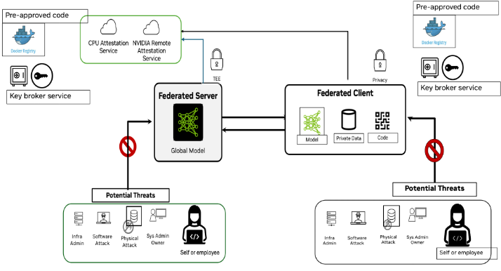
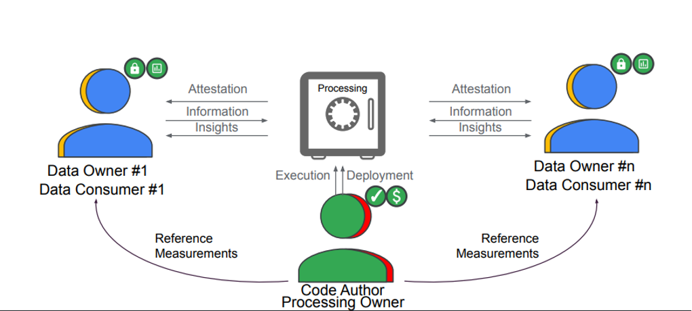
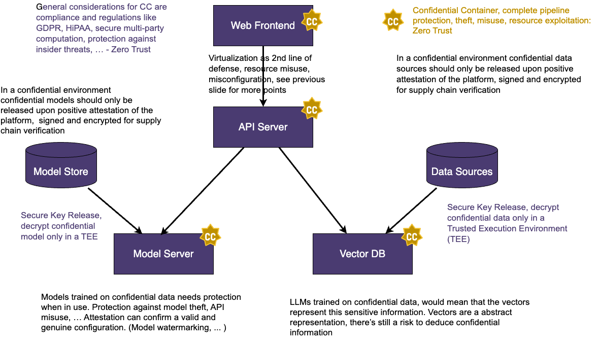
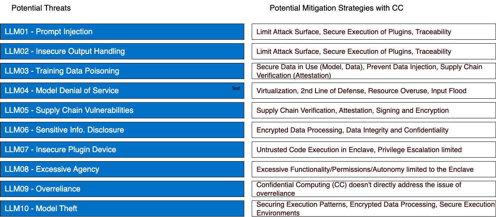

# Confidential AI

## Federated Learning

## Attestations
- Federated Learning requests multi-SDK attestation
- FL Servers needs to verify all client’s trustworthiness
- Attestation at different points, self and cross verifications via attestation service

## CC Policies:
- Bootup policy – provided by hardware vendor
- Self-verification CC policy – user defined
- Cross-verification CC policy  -- user defined

## Protected Assets
- **Code**: Training code (client), aggregation code (server)
- **Data**: input data
- **Model**:  initial model, intermediate model, output model
- **Workspace**: check points, logs, temp data, output directory

## Key Broker Service
- Key management depends on user case, global model ownership, key release management process

## Bootstrap:
- Need a process to generate the keys, policies and input them into key-vault to avoid tempering

### Concerns when using federated learning
- Trustworthy of the participants
- Execution code tampering
- Model tampering
- Model inversion attack
- Model theft during training
- Private data leak 

### CoCo will not protect if
- code is already flawed at rest
- data is already poisoned at rest
- model is already poisoned at rest

## Multi-Party Computing

Source: [https://uploads-ssl.webflow.com/63c54a346e01f30e726f97cf/6418fb932b58e284018fdac0_OC3%20-%20Keith%20Moyer%20-%20MPC%20with%20CC.pdf](https://uploads-ssl.webflow.com/63c54a346e01f30e726f97cf/6418fb932b58e284018fdac0_OC3%20-%20Keith%20Moyer%20-%20MPC%20with%20CC.pdf)

### Requirements
- Attestation-cross-verification
  - In MPC or FL cases, we need to explicitly verify all participants to be trustworthy according to the cross verification CC policy. 
- Periodic self-check test and cross-verification
  - a long running workload can ensure that the TEE is still valid
- Ad hoc attestation verification for given participation node
  - From CLI or API, application wants to know what’s the current status (trustworthiness) of the specified node
- Attestation audit report 
  - each party would like to get details on when attestation was performed by the TEE and relevant details
- Connecting to multiple KBSes
  - the workload needs to connect to different KBS each belonging to a specific party for getting access to the keys
- Support multiple devices
  - One participant may has only one type of device (CPU), but need to verify other participant’s devices including different CPU and GPU

## Retrieval Augmented Generation Large Language Models (RAG LLM)

Further RAG Use Case Information 
- [NVIDIA Generative AI Examples](https://github.com/NVIDIA/GenerativeAIExamples)

### Threat Model
Potential Threats: [OWASP Top 10 for LLMs](https://owasp.org/www-project-top-10-for-large-language-model-applications/)

